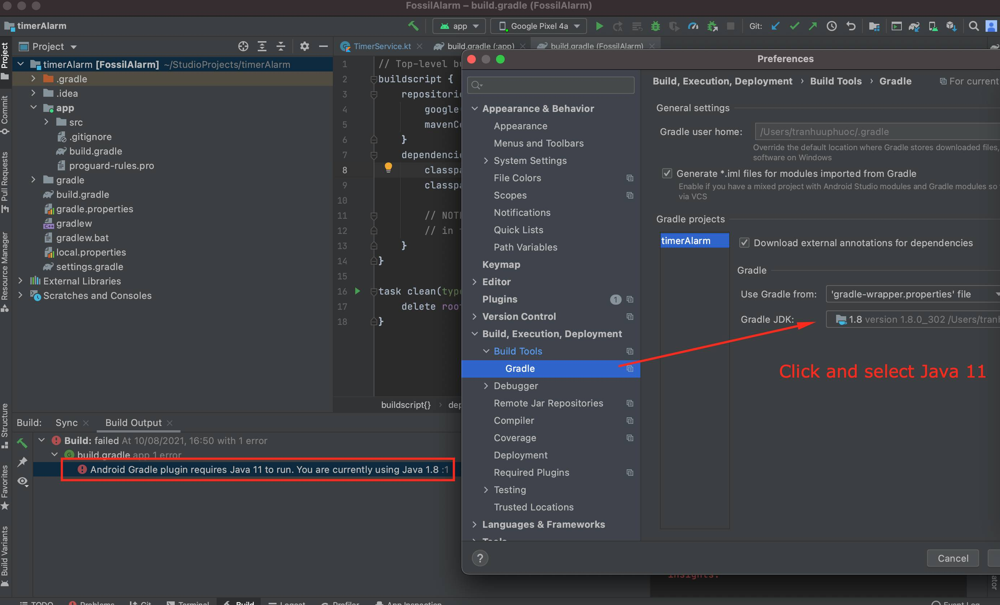

# timerAlarm
How to build:
1. Before build make sure Android Studio is using java 11 instead of Java 1.8
2. Go Android Preferences > Build > Gradle > Select Java 11 in dropdown box Gradle JDK

   
Download apk in here:
